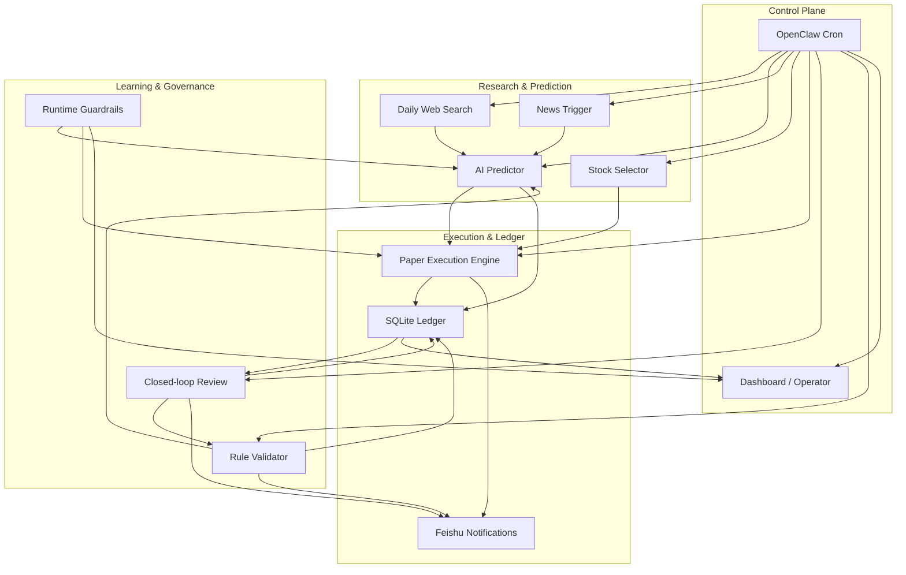
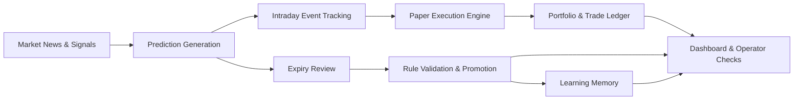

<div align="center">

# China Stock Team

An OpenClaw-managed research, prediction, and paper-trading system for the China A-share market.

[简体中文](README.zh-CN.md) | [English](README.en.md)


</div>

This repository is not a single stock screener and not just an agent demo that sends reports. It is a long-running operating system built around news tracking, prediction generation, rule validation, simulated execution, closed-loop review, and operator monitoring.

> Default posture: automate the simulation loop, keep human supervision for real-money decisions.

## Quick Links

- [Landing README](README.md)
- [中文 README](README.zh-CN.md)
- [Operations Manual](README_v3.md)
- [Deploy With OpenClaw](OPENCLAW_DEPLOY.md)
- [OpenClaw Operator Checklist](docs/OPENCLAW_OPERATOR_CHECKLIST_2026-03-26.md)

## Contents

- [Features](#features)
- [Architecture](#architecture)
- [Overview](#overview)
- [Quick Start](#quick-start)
- [Configuration and Security](#configuration-and-security)
- [Documentation](#documentation)
- [Current Scope](#current-scope)

## Features

<table>
  <tr>
    <td width="50%">
      <strong>Research Input Layer</strong><br/>
      Collects market news, tracks the watchlist, and updates event-driven research throughout the trading day.
    </td>
    <td width="50%">
      <strong>Prediction & Review Layer</strong><br/>
      Generates structured predictions and feeds verified results back into the accuracy and learning loop.
    </td>
  </tr>
  <tr>
    <td width="50%">
      <strong>Rule Learning Layer</strong><br/>
      Maintains the rule library, validation pool, promotion path, rejection path, and confidence updates.
    </td>
    <td width="50%">
      <strong>Paper Execution Layer</strong><br/>
      Handles simulated orders, partial fills, slippage, fees, and reconciliation into the core ledger.
    </td>
  </tr>
  <tr>
    <td width="50%">
      <strong>Runtime Guardrails</strong><br/>
      Provides auto read-only mode, task locks, retry tracking, fallback recording, and failure containment.
    </td>
    <td width="50%">
      <strong>Operator Cockpit</strong><br/>
      Shows cron status, rules, trades, freshness checks, self-healing events, and autopilot readiness in one place.
    </td>
  </tr>
</table>

## Architecture



## Overview

| Item | Value |
| --- | --- |
| Primary use case | China A-share research and paper trading |
| Orchestration | `OpenClaw cron` |
| Source of truth | `database/stock_team.db` |
| Execution mode | paper trading by default |
| Notifications | Feishu webhook, sent by business scripts |
| Dashboard | `web/dashboard_v3.py` on `8082` |
| Runtime model | OpenClaw main chat + cron-managed workflow |

## Why This Project Exists

Most “AI for stocks” projects solve only one segment of the workflow, such as screening, news summarization, or backtest reporting. China Stock Team is built to run the full daily loop:

- collect market inputs before the open
- generate predictions and watch intraday events
- run dynamic stock selection, expiry review, and rule validation after the close
- turn new knowledge and lessons into rules at night
- monitor cron, ledgers, rules, and safety guardrails from one dashboard

## Core Capabilities

- `News-driven research`: tracks market, watchlist, and holding-related news
- `Prediction pipeline`: generates directional views, confidence, and risk notes in a reviewable format
- `Rule engine`: maintains a rule library, validation pool, promotion, and rejection workflow
- `Paper execution`: supports simulated orders, fills, partial fills, fees, slippage, and open remainders
- `Closed-loop review`: verifies expired predictions, updates accuracy, and feeds results back into learning
- `Operator dashboard`: shows cron status, risk, rules, watchlist, trading, and autopilot state
- `Runtime guardrails`: supports auto read-only mode, task locks, recovery retries, fallback tracking, and pipeline closure

## System Design

### Operating Principles

- `OpenClaw cron` is the only scheduling control plane
- SQLite is the primary system of record
- JSON files remain only as a compatibility layer
- Feishu notifications are sent by the business scripts themselves
- The dashboard reflects live system state rather than manually maintained status
- Trading remains in simulation mode unless a real broker path is added explicitly

### End-to-End Flow



## Quick Start

### 1. Clone and bootstrap

```bash
git clone https://github.com/jjjojoj/stock-team.git
cd stock-team
bash scripts/bootstrap_openclaw.sh
```

### 2. Start the dashboard

```bash
python3 web/dashboard_v3.py
```

Open:

- `http://127.0.0.1:8082`
- `http://127.0.0.1:8082/cron`

### 3. Run core tasks manually

```bash
# Dynamic stock selection
python3 scripts/selector.py top 5

# Morning prediction generation
python3 scripts/ai_predictor.py generate

# Rule validation report
python3 scripts/rule_validator.py report

# Expiry review
python3 scripts/daily_review_closed_loop.py report
```

## OpenClaw Deployment

If you want another OpenClaw user to deploy the full project end-to-end, use the turnkey prompt in [OPENCLAW_DEPLOY.md](OPENCLAW_DEPLOY.md).

The shortest usable instruction is:

```text
请把 jjjojoj/stock-team 部署到本地 ~/.openclaw/workspace/china-stock-team：如果目录不存在就 clone，进入项目后执行 bash scripts/bootstrap_openclaw.sh，不要把任何 webhook 或 API key 写进 git 跟踪文件；如需飞书通知就引导我把 webhook 写到 config/feishu_config.local.json 或 FEISHU_WEBHOOK_URL，最后启动 python3 web/dashboard_v3.py 并验证 http://127.0.0.1:8082 可访问。
```

## What Runs by Default

The current mainline is designed for long-running simulation, not direct brokerage execution.

Enabled by default:

- research and news monitoring
- prediction generation and review
- rule validation and learning
- paper-trading execution ledger
- dashboard-based operations monitoring
- Feishu notification pipeline

Not enabled by default:

- real broker connectivity
- live order routing
- unattended real-money execution

## Configuration and Security

### Feishu notifications

Webhook values must remain local.

Configuration priority:

1. `FEISHU_WEBHOOK_URL`
2. `config/feishu_config.local.json`
3. tracked defaults in `config/feishu_config.json`

Quick setup:

```bash
cp config/feishu_config.local.example.json config/feishu_config.local.json
```

Then put the webhook into the local file, or export:

```bash
export FEISHU_WEBHOOK_URL="https://open.feishu.cn/open-apis/bot/v2/hook/your-local-webhook"
```

Validate delivery:

```bash
python3 scripts/feishu_notifier.py --test
```

### Runtime safety

Runtime protection is managed through:

- [config/runtime_guardrails.json](config/runtime_guardrails.json)
- [core/runtime_guardrails.py](core/runtime_guardrails.py)

These guardrails control:

- auto read-only mode
- task locks
- upstream dependency blocking
- retry and recovery tracking
- datasource fallback recording

## Project Structure

```text
china-stock-team/
├── adapters/        # market and search data adapters
├── agents/          # team roles and character files
├── config/          # tracked config and local templates
├── core/            # shared storage, execution, guardrails, fundamentals
├── data/            # runtime outputs and caches
├── database/        # SQLite databases
├── docs/            # architecture, operator, and design docs
├── learning/        # rules, validation pool, learning assets
├── research/        # research outputs and references
├── scripts/         # main business workflows
├── tests/           # regression and unit tests
└── web/             # dashboard and cron status endpoints
```

## Key Entry Points

| Path | Purpose |
| --- | --- |
| `scripts/daily_web_search.py` | market and watchlist research input |
| `scripts/ai_predictor.py` | prediction generation |
| `scripts/news_trigger.py` | intraday event-triggered updates |
| `scripts/selector.py` | dynamic stock selection |
| `scripts/auto_trader_v3.py` | paper execution and buy/sell logic |
| `scripts/daily_review_closed_loop.py` | expiry review and feedback loop |
| `scripts/rule_validator.py` | rule validation and promotion |
| `core/simulated_execution.py` | realistic paper-trading order engine |
| `core/runtime_guardrails.py` | autopilot safety and self-healing |
| `web/dashboard_v3.py` | operations dashboard |

## Testing

Core regression command:

```bash
python3 -m unittest \
  tests.test_feishu_notifier \
  tests.test_enhanced_cron_handler \
  tests.test_prediction_utils \
  tests.test_storage_sync \
  tests.test_rule_storage \
  tests.test_dashboard_v3
```

Execution and guardrail coverage:

```bash
python3 -m unittest \
  tests.test_simulated_execution \
  tests.test_runtime_guardrails \
  tests.test_real_data_paths
```

## Documentation

### Operator and deployment

- [Chinese README](README.zh-CN.md)
- [Operations Manual](README_v3.md)
- [Deploy With OpenClaw](OPENCLAW_DEPLOY.md)
- [OpenClaw Operator Checklist](docs/OPENCLAW_OPERATOR_CHECKLIST_2026-03-26.md)

### Architecture and standards

- [Data Standard](DATA_STANDARD.md)
- [Architecture Overview](docs/architecture_v3.md)
- [Cron Task Design](docs/CRON_TASKS.md)
- [Complete Loop Overview](docs/COMPLETE_LOOP_v3.md)
- [Rule System Explained](docs/RULE_SYSTEM_EXPLAINED.md)

### Governance and environment

- [Team Charter](TEAM_CHARTER.md)
- [Real Trading Environment Notes](REAL_TRADING_ENV.md)
- [Version Log](VERSION.md)

## Current Scope

This repository is already suitable for:

- long-running simulation
- rule-learning validation
- OpenClaw-managed daily operation
- operator-in-the-loop supervision

It is not positioned as:

- one-click retail brokerage automation
- guaranteed-profit strategy software
- fully autonomous real-money trading

## Notes

- Runtime data, logs, and learning artifacts change continuously and should not be treated as code state
- If you need to purge previously exposed secrets from git history, that requires a separate history rewrite
