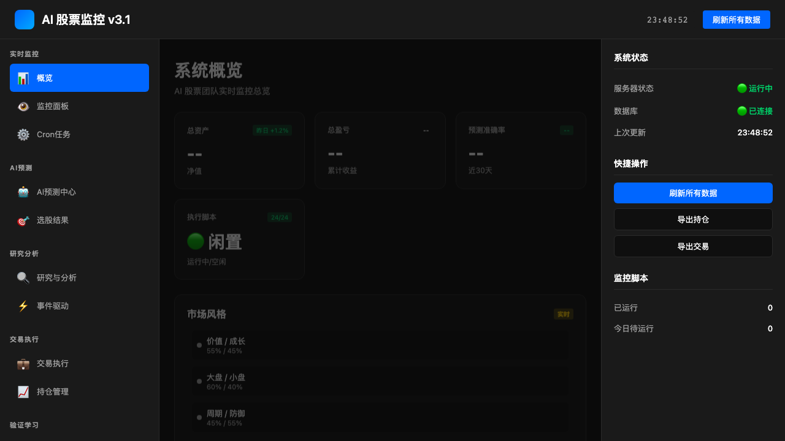
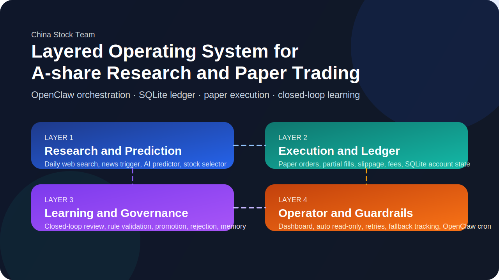
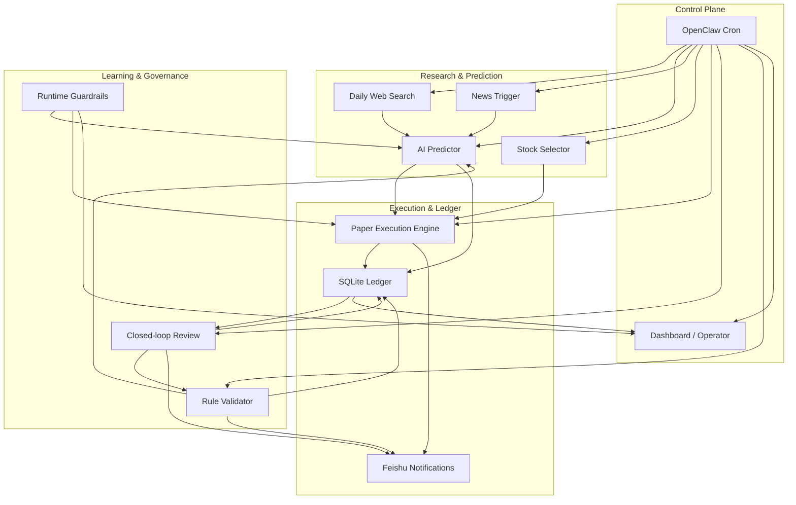

<div align="center">

# China Stock Team

An OpenClaw-managed research, rule-learning, and paper-trading system for the China A-share market.

[简体中文](README.zh-CN.md) | [English](README.en.md)


</div>

China Stock Team is designed as a long-running operating system rather than a single stock-picking script. It combines market news tracking, prediction generation, rule validation, simulated execution, closed-loop review, and operator monitoring into one workflow.

> Default posture: automate the daily simulation loop, keep human oversight for real-money decisions.

## Preview



## Quick Links

- [中文文档](README.zh-CN.md)
- [English docs](README.en.md)
- [Operations Manual](README_v3.md)
- [Deploy With OpenClaw](OPENCLAW_DEPLOY.md)
- [Operator Checklist](docs/OPENCLAW_OPERATOR_CHECKLIST_2026-03-26.md)

## Contents

- [Features](#features)
- [System Layers](#system-layers)
- [Current Status](#current-status)
- [Architecture](#architecture)
- [Quick Facts](#quick-facts)
- [Quick Start](#quick-start)
- [Documentation](#documentation)
- [Scope](#scope)

## Features

<table>
  <tr>
    <td width="50%">
      <strong>Research Pipeline</strong><br/>
      Market news collection, watchlist tracking, and event-driven research updates for the A-share universe.
    </td>
    <td width="50%">
      <strong>Prediction & Review</strong><br/>
      Structured prediction generation with expiry review, accuracy tracking, and feedback into the learning loop.
    </td>
  </tr>
  <tr>
    <td width="50%">
      <strong>Rule Learning System</strong><br/>
      Rule library, validation pool, promotion, rejection, and confidence updates driven by observed outcomes.
    </td>
    <td width="50%">
      <strong>Paper Execution Engine</strong><br/>
      Simulated orders, partial fills, slippage, fees, and order reconciliation backed by SQLite.
    </td>
  </tr>
  <tr>
    <td width="50%">
      <strong>Runtime Guardrails</strong><br/>
      Auto read-only mode, task locks, retry tracking, datasource fallback recording, and pipeline closure.
    </td>
    <td width="50%">
      <strong>Operator Dashboard</strong><br/>
      A single cockpit for cron status, rules, trades, freshness checks, self-healing events, and autopilot state.
    </td>
  </tr>
</table>

## System Layers



## Current Status

<table>
  <tr>
    <td width="50%">
      <strong>Current Status</strong><br/><br/>
      ✅ End-to-end simulation loop is running under OpenClaw cron<br/>
      ✅ SQLite is the primary ledger for portfolio, predictions, rules, and paper execution<br/>
      ✅ Paper execution now supports orders, partial fills, slippage, fees, and reconciliation<br/>
      ✅ Dashboard exposes cron health, guardrails, self-healing, and execution state<br/>
      ⏳ Real broker connectivity is intentionally not enabled by default
    </td>
    <td width="50%">
      <strong>Roadmap</strong><br/><br/>
      <strong>Near term</strong>: richer paper-trading analytics and tighter operator signals<br/>
      <strong>Mid term</strong>: stronger fallback orchestration and more resilient research data inputs<br/>
      <strong>Long term</strong>: guarded live-trading mode with explicit human approval gates
    </td>
  </tr>
</table>

## Architecture



## Quick Facts

| Item | Value |
| --- | --- |
| Orchestration | `OpenClaw cron` |
| Source of truth | `database/stock_team.db` |
| Execution mode | paper trading by default |
| Notifications | Feishu webhook, script-owned delivery |
| Dashboard | `web/dashboard_v3.py` on `8082` |

## Quick Start

```bash
git clone https://github.com/jjjojoj/stock-team.git
cd stock-team
bash scripts/bootstrap_openclaw.sh
python3 web/dashboard_v3.py
```

Open:

- `http://127.0.0.1:8082`
- `http://127.0.0.1:8082/cron`

## Documentation

- [中文 README](README.zh-CN.md)
- [English README](README.en.md)
- [Operations Manual](README_v3.md)
- [Deploy With OpenClaw](OPENCLAW_DEPLOY.md)
- [OpenClaw Operator Checklist](docs/OPENCLAW_OPERATOR_CHECKLIST_2026-03-26.md)

## Scope

This repository is intended for:

- long-running simulation
- rule-learning validation
- OpenClaw-managed daily operation
- operator-in-the-loop supervision

It is not positioned as:

- one-click retail brokerage automation
- guaranteed-profit strategy software
- fully autonomous real-money trading
