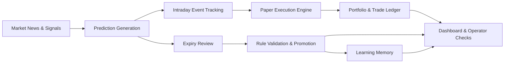

# China Stock Team

一个面向 A 股场景的 OpenClaw 托管式投研与模拟交易系统。

它不是单一的选股脚本，也不是只会发日报的 Agent Demo，而是一套围绕“新闻跟踪、预测生成、规则验证、模拟交易、复盘学习、监控值守”构建的长期运行系统。

## Overview

| Item | Value |
| --- | --- |
| Primary use case | A 股投研与模拟交易 |
| Orchestration | `OpenClaw cron` |
| Source of truth | `database/stock_team.db` |
| Execution mode | Paper trading by default |
| Notifications | Feishu webhook, script-owned delivery |
| Dashboard | `web/dashboard_v3.py` on `8082` |
| Runtime model | OpenClaw main chat + cron-managed workflow |

## Why This Project Exists

大多数“股票 AI 项目”只做到其中一段，比如选股、消息总结或回测展示。China Stock Team 的目标不是做一个漂亮的单点能力，而是把一条完整的日常链路真正跑起来：

- 开盘前收集市场信息并生成预测
- 盘中跟踪新闻、事件和风险变化
- 收盘后执行动态选股、到期复盘和规则验证
- 夜间把新知识和经验沉淀进规则系统
- 用统一面板持续监控 cron、账本、规则和运行护栏

## Core Capabilities

- `News-driven research`: 跟踪市场新闻、观察池新闻和持仓相关新闻
- `Prediction pipeline`: 生成方向判断、置信度和风险说明，并进入可复盘状态
- `Rule engine`: 维护规则库、验证池、晋升和淘汰流程
- `Paper execution`: 模拟下单、成交、部分成交、手续费、滑点和剩余挂单
- `Closed-loop review`: 到期预测验证、准确率更新、规则调权和经验沉淀
- `Operator dashboard`: 展示 cron 状态、风险、规则、观察池、交易和托管状态
- `Runtime guardrails`: 自动只读、任务锁、自愈补跑、备用源切换、链路收口

## System Design

### Operating Principles

- `OpenClaw cron` is the only scheduling control plane
- SQLite is the primary system of record
- JSON exists as a compatibility layer, not as the canonical source
- Feishu messages are sent by the business scripts themselves
- The dashboard reflects live system state, not hand-maintained status
- Trading stays in simulation mode unless you explicitly add a real broker path

### End-to-End Flow



## Quick Start

### 1. Clone and bootstrap

```bash
git clone https://github.com/jjjojoj/stock-team.git
cd stock-team
bash scripts/bootstrap_openclaw.sh
```

### 2. Start the dashboard

```bash
python3 web/dashboard_v3.py
```

Open the dashboard at:

- `http://127.0.0.1:8082`
- `http://127.0.0.1:8082/cron`

### 3. Run core tasks manually

```bash
# Dynamic stock selection
python3 scripts/selector.py top 5

# Morning prediction generation
python3 scripts/ai_predictor.py generate

# Rule validation report
python3 scripts/rule_validator.py report

# Expiry review
python3 scripts/daily_review_closed_loop.py report
```

## OpenClaw Deployment

If you want another OpenClaw user to deploy this project end-to-end, use the turnkey prompt in [OPENCLAW_DEPLOY.md](OPENCLAW_DEPLOY.md).

The shortest usable instruction is:

```text
请把 jjjojoj/stock-team 部署到本地 ~/.openclaw/workspace/china-stock-team：如果目录不存在就 clone，进入项目后执行 bash scripts/bootstrap_openclaw.sh，不要把任何 webhook 或 API key 写进 git 跟踪文件；如需飞书通知就引导我把 webhook 写到 config/feishu_config.local.json 或 FEISHU_WEBHOOK_URL，最后启动 python3 web/dashboard_v3.py 并验证 http://127.0.0.1:8082 可访问。
```

## What Runs in Production-Like Mode

The current mainline is designed for long-running simulation, not direct brokerage execution.

Enabled by default:

- research and news monitoring
- prediction generation and review
- rule validation and learning
- paper-trading execution ledger
- dashboard-based operational monitoring
- Feishu notification pipeline

Not enabled by default:

- real broker connectivity
- live order routing
- unattended real-money execution

## Configuration and Security

### Feishu notifications

Webhook values must stay local.

Supported configuration order:

1. `FEISHU_WEBHOOK_URL`
2. `config/feishu_config.local.json`
3. tracked defaults in `config/feishu_config.json`

Quick setup:

```bash
cp config/feishu_config.local.example.json config/feishu_config.local.json
```

Then put your webhook in the local file or export:

```bash
export FEISHU_WEBHOOK_URL="https://open.feishu.cn/open-apis/bot/v2/hook/your-local-webhook"
```

Validate delivery:

```bash
python3 scripts/feishu_notifier.py --test
```

### Runtime safety

The system includes runtime protection via:

- [config/runtime_guardrails.json](config/runtime_guardrails.json)
- [core/runtime_guardrails.py](core/runtime_guardrails.py)

These guardrails control:

- auto read-only mode
- task locks
- upstream dependency blocking
- retry and recovery tracking
- datasource fallback recording

## Project Structure

```text
china-stock-team/
├── adapters/        # market/search data adapters
├── agents/          # team roles and character files
├── config/          # tracked config and local templates
├── core/            # shared storage, execution, guardrails, fundamentals
├── data/            # runtime outputs and caches
├── database/        # SQLite databases
├── docs/            # architecture, operator docs, design notes
├── learning/        # rules, validation pool, knowledge artifacts
├── research/        # research outputs and references
├── scripts/         # main business workflows
├── tests/           # regression and unit tests
└── web/             # dashboard and cron status endpoints
```

## Key Entry Points

| Path | Purpose |
| --- | --- |
| `scripts/daily_web_search.py` | market and watchlist research input |
| `scripts/ai_predictor.py` | prediction generation |
| `scripts/news_trigger.py` | intraday event-triggered updates |
| `scripts/selector.py` | dynamic stock selection |
| `scripts/auto_trader_v3.py` | paper execution and sell/buy logic |
| `scripts/daily_review_closed_loop.py` | expiry review and feedback loop |
| `scripts/rule_validator.py` | rule validation and promotion |
| `core/simulated_execution.py` | realistic paper-trading order engine |
| `core/runtime_guardrails.py` | autopilot safety and self-healing |
| `web/dashboard_v3.py` | operations dashboard |

## Testing

Core regression command:

```bash
python3 -m unittest \
  tests.test_feishu_notifier \
  tests.test_enhanced_cron_handler \
  tests.test_prediction_utils \
  tests.test_storage_sync \
  tests.test_rule_storage \
  tests.test_dashboard_v3
```

Execution and guardrail coverage:

```bash
python3 -m unittest \
  tests.test_simulated_execution \
  tests.test_runtime_guardrails \
  tests.test_real_data_paths
```

## Documentation

### Operator and deployment

- [Operations Manual](README_v3.md)
- [Deploy With OpenClaw](OPENCLAW_DEPLOY.md)
- [OpenClaw Operator Checklist](docs/OPENCLAW_OPERATOR_CHECKLIST_2026-03-26.md)

### Architecture and standards

- [Data Standard](DATA_STANDARD.md)
- [Architecture Overview](docs/architecture_v3.md)
- [Cron Task Design](docs/CRON_TASKS.md)
- [Complete Loop Overview](docs/COMPLETE_LOOP_v3.md)
- [Rule System Explained](docs/RULE_SYSTEM_EXPLAINED.md)

### Governance and environment

- [Team Charter](TEAM_CHARTER.md)
- [Real Trading Environment Notes](REAL_TRADING_ENV.md)
- [Version Log](VERSION.md)

## Current Scope

This repository is already suitable for:

- long-running simulation
- rule-learning validation
- OpenClaw-managed daily operation
- operator-in-the-loop supervision

It is not yet positioned as:

- a retail one-click brokerage bot
- a guaranteed profitable strategy package
- a fully autonomous real-money trading system

## Notes

- Runtime data, logs and learning artifacts change continuously and should not be treated as code state
- If you need to purge previously exposed secrets from git history, that requires a separate history rewrite
