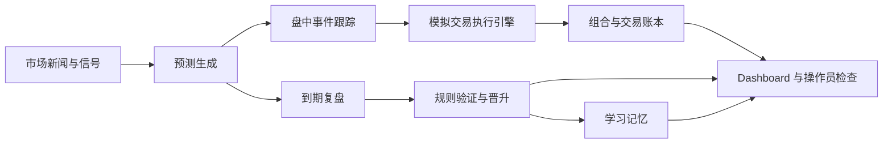

<div align="center">

# China Stock Team

一个面向 A 股场景的 OpenClaw 托管式投研与模拟交易系统。

[简体中文](README.zh-CN.md) | [English](README.en.md)


</div>

它不是单一的选股脚本，也不是只会发日报的 Agent Demo，而是一套围绕“新闻跟踪、预测生成、规则验证、模拟交易、复盘学习、监控值守”构建的长期运行系统。

> 默认定位：自动化跑完整个模拟交易闭环，但真实资金决策仍保留人工监督。

## 快速入口

- [GitHub 首页入口](README.md)
- [English README](README.en.md)
- [运行手册](README_v3.md)
- [OpenClaw 部署说明](OPENCLAW_DEPLOY.md)
- [OpenClaw 操作员巡检清单](docs/OPENCLAW_OPERATOR_CHECKLIST_2026-03-26.md)

## 目录

- [项目概览](#项目概览)
- [快速开始](#快速开始)
- [配置与安全](#配置与安全)
- [文档入口](#文档入口)
- [当前定位](#当前定位)

## 项目概览

| 项目 | 说明 |
| --- | --- |
| 主要用途 | A 股投研与模拟交易 |
| 调度方式 | `OpenClaw cron` |
| 主真源 | `database/stock_team.db` |
| 执行模式 | 默认模拟交易 |
| 通知方式 | 飞书 webhook，由业务脚本自行发送 |
| 面板入口 | `web/dashboard_v3.py`，默认端口 `8082` |
| 运行形态 | OpenClaw 主对话 + cron 管理工作流 |

## 为什么有这个项目

很多“股票 AI 项目”只做到链路中的一段，比如选股、新闻总结或回测展示。China Stock Team 的目标不是做一个单点能力，而是把一条能长期跑起来的完整链路真正落到系统里：

- 开盘前收集市场信息并生成预测
- 盘中跟踪新闻、事件和风险变化
- 收盘后执行动态选股、到期复盘和规则验证
- 夜间把知识和经验沉淀进规则系统
- 用统一面板持续监控 cron、账本、规则和运行护栏

## 核心能力

- `新闻驱动研究`：跟踪市场、观察池与持仓相关资讯
- `预测流水线`：生成方向判断、置信度和风险说明，并进入可复盘状态
- `规则引擎`：维护规则库、验证池、晋升与淘汰流程
- `模拟交易执行`：支持模拟下单、成交、部分成交、手续费、滑点和剩余挂单
- `闭环复盘`：到期预测验证、准确率更新、规则调权和经验沉淀
- `运维驾驶舱`：展示 cron、风险、规则、观察池、交易和托管状态
- `运行护栏`：自动只读、任务锁、自愈补跑、备用源切换、链路收口

## 系统设计

### 运行原则

- `OpenClaw cron` 是唯一调度控制面
- SQLite 是系统主账本
- JSON 仅作为兼容层，不再是唯一真源
- 飞书消息由业务脚本自己发送
- Dashboard 展示的是实时系统状态，而不是手工维护的静态状态
- 在未接入真实券商前，交易默认保持在模拟模式

### 端到端链路



## 快速开始

### 1. 克隆并初始化

```bash
git clone https://github.com/jjjojoj/stock-team.git
cd stock-team
bash scripts/bootstrap_openclaw.sh
```

### 2. 启动监控面板

```bash
python3 web/dashboard_v3.py
```

访问地址：

- `http://127.0.0.1:8082`
- `http://127.0.0.1:8082/cron`

### 3. 手动运行核心任务

```bash
# 动态选股
python3 scripts/selector.py top 5

# 生成早盘预测
python3 scripts/ai_predictor.py generate

# 查看规则验证报告
python3 scripts/rule_validator.py report

# 执行到期复盘
python3 scripts/daily_review_closed_loop.py report
```

## 用 OpenClaw 部署

如果你要把这个项目交给另一个 OpenClaw 用户完整部署，直接使用 [OPENCLAW_DEPLOY.md](OPENCLAW_DEPLOY.md) 里的开箱即用提示词。

最短可用的一句话是：

```text
请把 jjjojoj/stock-team 部署到本地 ~/.openclaw/workspace/china-stock-team：如果目录不存在就 clone，进入项目后执行 bash scripts/bootstrap_openclaw.sh，不要把任何 webhook 或 API key 写进 git 跟踪文件；如需飞书通知就引导我把 webhook 写到 config/feishu_config.local.json 或 FEISHU_WEBHOOK_URL，最后启动 python3 web/dashboard_v3.py 并验证 http://127.0.0.1:8082 可访问。
```

## 当前默认运行范围

当前主线面向的是长期运行的模拟托管，不是直接接券商下单。

默认启用：

- 研究与新闻监控
- 预测生成与复盘
- 规则验证与学习
- 模拟交易执行账本
- 基于 Dashboard 的运维监控
- 飞书通知链路

默认不启用：

- 实盘券商连接
- 真实订单路由
- 无人值守的真实资金执行

## 配置与安全

### 飞书通知

Webhook 只应保存在本地，不应进入仓库。

配置优先级：

1. `FEISHU_WEBHOOK_URL`
2. `config/feishu_config.local.json`
3. `config/feishu_config.json` 中的共享默认项

快速配置：

```bash
cp config/feishu_config.local.example.json config/feishu_config.local.json
```

然后把 webhook 写入本地文件，或直接设置环境变量：

```bash
export FEISHU_WEBHOOK_URL="https://open.feishu.cn/open-apis/bot/v2/hook/your-local-webhook"
```

测试连通性：

```bash
python3 scripts/feishu_notifier.py --test
```

### 运行护栏

系统的运行安全由下面两部分提供：

- [config/runtime_guardrails.json](config/runtime_guardrails.json)
- [core/runtime_guardrails.py](core/runtime_guardrails.py)

它们负责：

- 自动只读
- 任务锁
- 上游依赖阻断
- 补跑与恢复跟踪
- 备用数据源切换记录

## 项目结构

```text
china-stock-team/
├── adapters/        # 市场/搜索数据适配层
├── agents/          # 团队角色与行为定义
├── config/          # 跟踪配置与本地模板
├── core/            # 存储、执行、护栏、基本面共享层
├── data/            # 运行时输出与缓存
├── database/        # SQLite 数据库
├── docs/            # 架构、值守、设计文档
├── learning/        # 规则、验证池与学习资产
├── research/        # 研究输出与参考资料
├── scripts/         # 核心业务脚本
├── tests/           # 回归与单元测试
└── web/             # Dashboard 与 cron 状态接口
```

## 关键入口

| 路径 | 作用 |
| --- | --- |
| `scripts/daily_web_search.py` | 市场与观察池研究输入 |
| `scripts/ai_predictor.py` | 预测生成 |
| `scripts/news_trigger.py` | 盘中事件触发更新 |
| `scripts/selector.py` | 动态标准选股 |
| `scripts/auto_trader_v3.py` | 模拟交易执行与买卖逻辑 |
| `scripts/daily_review_closed_loop.py` | 到期复盘与反馈闭环 |
| `scripts/rule_validator.py` | 规则验证与晋升 |
| `core/simulated_execution.py` | 更真实的模拟交易引擎 |
| `core/runtime_guardrails.py` | 托管安全与自愈逻辑 |
| `web/dashboard_v3.py` | 运维监控面板 |

## 测试

核心回归命令：

```bash
python3 -m unittest \
  tests.test_feishu_notifier \
  tests.test_enhanced_cron_handler \
  tests.test_prediction_utils \
  tests.test_storage_sync \
  tests.test_rule_storage \
  tests.test_dashboard_v3
```

执行层与护栏覆盖：

```bash
python3 -m unittest \
  tests.test_simulated_execution \
  tests.test_runtime_guardrails \
  tests.test_real_data_paths
```

## 文档入口

### 运维与部署

- [运行手册](README_v3.md)
- [OpenClaw 部署说明](OPENCLAW_DEPLOY.md)
- [OpenClaw 操作员巡检清单](docs/OPENCLAW_OPERATOR_CHECKLIST_2026-03-26.md)

### 架构与标准

- [数据标准](DATA_STANDARD.md)
- [架构总览](docs/architecture_v3.md)
- [Cron 任务设计](docs/CRON_TASKS.md)
- [完整闭环说明](docs/COMPLETE_LOOP_v3.md)
- [规则系统说明](docs/RULE_SYSTEM_EXPLAINED.md)

### 治理与环境

- [团队章程](TEAM_CHARTER.md)
- [实盘环境说明](REAL_TRADING_ENV.md)
- [版本记录](VERSION.md)

## 当前定位

这个仓库已经适合：

- 长期运行的模拟盘
- 规则学习与验证
- OpenClaw 管理下的日常自动运行
- 有操作员监督的半自动托管

它目前还不是：

- 零配置的散户券商机器人
- 保证盈利的策略产品
- 完全自治的真实资金交易系统

## 说明

- 运行时数据、日志和学习资产会持续变化，不应把它们当作代码版本状态
- 如果要彻底清理 Git 历史里曾出现过的敏感信息，需要额外做历史重写
